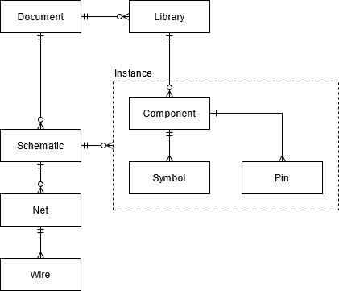

# Design

Due to the ambition making the application support multiplayer it would be wise to adopt some form of [MVC, MVP, MVVM](https://stackoverflow.com/questions/19444431/what-is-difference-between-mvc-mvp-mvvm-design-pattern-in-terms-of-coding-c-s) architecture. This would allow a CRDT library such as [Y.js](https://docs.yjs.dev/) to be easily integrated into the application. In addition, it may enable multiple views to be implemented for other platforms.

## Model

The model is arguably the most important part of the application. I personally believe that the architecture of most other EDA software uses a flawed model for circuit components which doesn't enable good reuse of common elements. The most interesting organisation that I have seen is [Horizon EDAs concept](https://horizon-eda.readthedocs.io/en/latest/pool-why.html) which I will loosely use as a basis for my design. Due to the scope of this project, I will not consider circuit packages for PCB design, and will attempt to simplify the structure presented in Horizon EDA.

### Component

A component describes the logical definition of a circuit component. This includes the name and pins of the component. At some point it should also include data required to simulate it. Each pin can be given a defined name and type which may be used to lint the circuit. In addition, multiple symbols can be added to a component which describes the visual appearance of the component. For example, a resistor can be drawn with the ANSI or IEC symbol.
