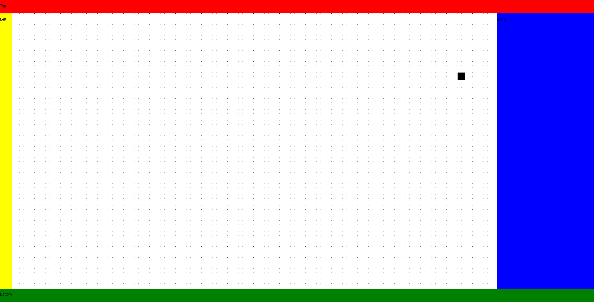

# Journal

This journal contains my weekly entries to record and reflect on my progress throughout the project. These entries will be also be copied and uploaded into Moodle at the end of each week.

## Week 01
*01-03-2021*

In the first week I worked to familiarise myself with the administrative aspects required by the unit. In addition, I outlined a short-list of projects that I would be interested in working on for the remainder of the year. I looked at projects offerred through the university and several of my own personal ideas which I have pondered throughout my degree:

* A collaborative web-based circuit schematic capture and simulation package. This would ideally be a replacement for [LTspice](https://www.analog.com/en/design-center/design-tools-and-calculators/ltspice-simulator.html) which is frequently used by undergraduate students to learn and understand analog circuits. The software is closed-source and is not very user-friendly. I believe a better Google Docs inspired clone would be of great practical use within the Monash community, but also for other universities, educational institutions and self-learners.

* A [RISC-V](https://en.wikipedia.org/wiki/RISC-V) CPU on an FPGA which implements a base instruction set and several extensions. In addition, I would be interested in exploring common CPU optimizations such as implementing a pipeline, cache and maybe even out-of-order-execution and branch-prediction. I don't believe this would provide as much practical use, as I am sure there already exists many RISC-V CPUs that are far more advanced than what I could develop. However, I believe it would be a good stepping stone for me to move into more advanced digital hardware design.

I got in touch with [Arthur Lowery](https://www.monash.edu/engineering/arthurlowery) to see if he would be happy to be my project supervisor as he is an experienced electrical engineer with a strong background in analog electronics and chief examiner of [ENG3161](https://handbook.monash.edu/2021/units/ECE3161). He was interested in the web-based circuit capture and simulation and was happy to supervise my project.

## Week 02
*08-03-2021*

I spent some time early in the week going through my project ideas to check that I was going to be happy to work on my allocated circuit capture and simulation project for the next year.

I decided I was happy, and locked in the idea and began to refine the idea and features of the project. It is important to remember that the risk analysis and requirements analysis are due in the middle of week 4. I didn't end up working on either of these during this week, but plan to start and finish them by the end of next week.

Instead, this week I created the [project repository](https://github.com/scottwillmoore/ece4094) on Github and worked to set up the infrastructure which I will use to develop the project. The project will be developed as a client-side [TypeScript](https://www.typescriptlang.org) application built on [React](https://reactjs.org/). It is currently built and bundled with [Node](https://nodejs.org/en/) and [Snowpack](https://www.snowpack.dev/).

As discussed earlier, I plan to target the web and therefore [TypeScript](https://www.typescriptlang.org) is an excellent language developed by Microsoft which allows [JavaScript](https://www.javascript.com/) to be written with types. This will help catch a large class of errors by ensuring code is correct at compile-time. It will also help to improve programming productivity as the project grows in size.

[React](https://reactjs.org/) is a library used to make building user-interfaces for the web much more managable with a declarative, component-based approach. It should help to simplify the process of developing the complex user-interface which will be required by this project.

I expect that there will be additional tools and software required in the future for aspects that haven't yet been thought about in extreme depth. Some of these tasks include:

* Implementation the server-side which is required for collaboration.
* Compilation and embedding of an open-source SPICE circuit simulator with [WebAssembly](https://webassembly.org/).

Finally, a very basic shell for the user-interface was implemented, along with a bare-bones, canvas-based renderer for the editor component of the app. A screenshot of the progress can be seen below:

For next week I plan to work primarily on the risk analysis and requirements analysis to make sure they are finished. I also plan to implement the ability to zoom, pan and scroll the editor viewport. Any other development will be an added bonus.
